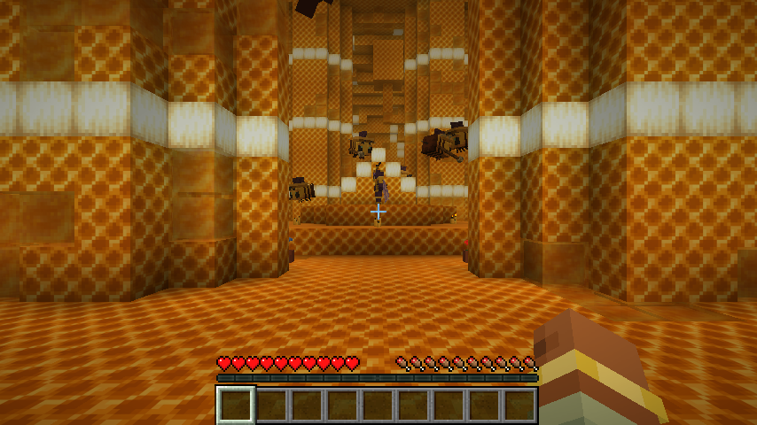
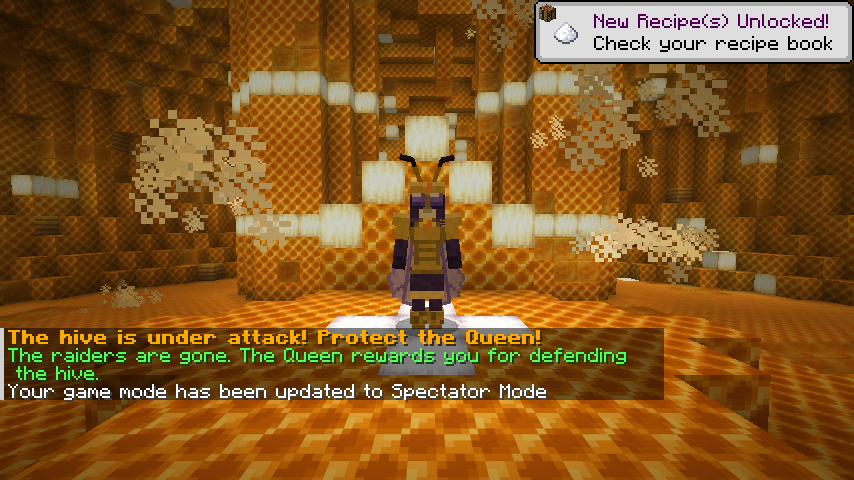
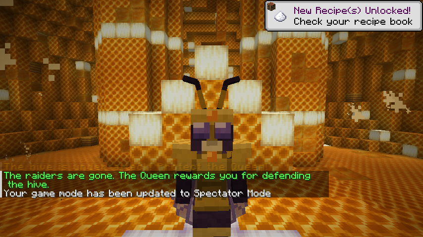
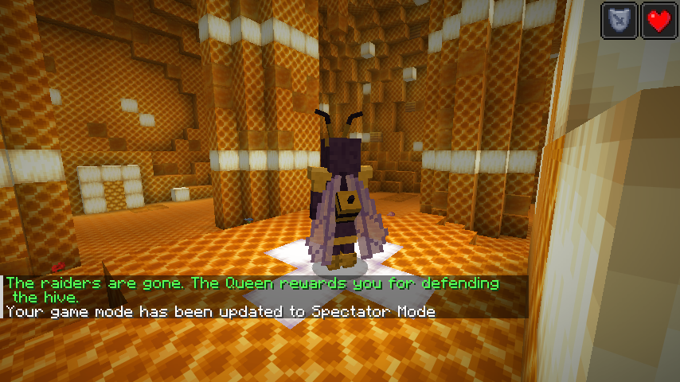
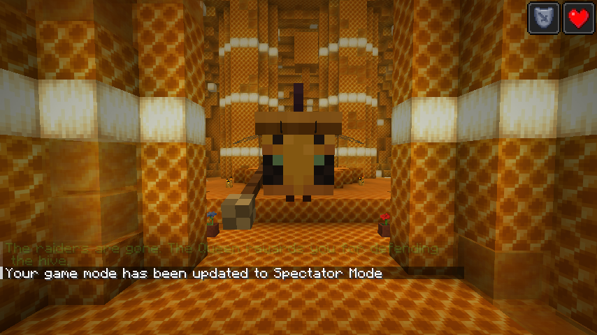
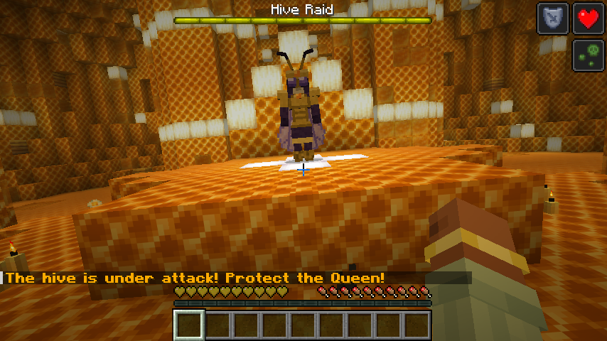

# Hivemind

A Fabric mod for Minecraft 26.3 that lets you shrink down and go inside a beehive.

## How to play

1. **Brew Shrinking Honey.** Shapeless recipe: honey bottle + fermented spider eye + glowstone dust.
   Drinking it gives you the *Shrunk* effect for 5 minutes and makes you a quarter of your normal size.
2. **Right-click a beehive or bee nest while shrunk.** You squeeze inside. Each hive in the world has
   its own interior, which is generated the first time anyone enters it.
3. **Explore the hive.** It's a big honeycomb dome with comb pillars, hanging combs and a raised
   dais in the middle where the **Queen Bee** lives. Worker bees fly around, and **Guard Bees**
   (bigger bees with helmets and little spears) patrol.
4. **Don't break anything.** The bees are neutral as long as you behave. Building isn't allowed, and blocks in the hive
   never actually break. Misclicks happen, so the first slip (breaking a block, or hitting one of the hive's bees) only
   gets you a warning buzz. Do it again within 30 seconds and the whole hive turns on you. Hitting the queen works the
   same way. Guard bees fight with their spears and can sting over and over without dying.
5. **Bring the queen flowers.** Right-click her with any flower. Each flower raises her favor toward
   you, and every third flower she hands you a gift (bone meal, honey, honeycomb, emeralds, beenades,
   royal jelly...). At higher favor her gifts get bigger. She can give a gift at most once every 30 seconds.
   Right-click her with an empty hand to say hi and see your favor.
   She talks back, Animal Crossing style: her lines type out above your hotbar while she babbles them in
   little buzzy syllables. Small talk only shows above the hotbar (gifts and raid lines also go in chat), she
   won't start a new line within a few seconds of the last one, and she only chats on her own every few minutes.
   She doesn't just sit there, either: every minute or two she gets up and walks to the nursery to lay eggs in
   any empty cells, then heads back to her throne.
6. **Help in the nursery.** Four patches of brood cells are set into the floor between the pillars, each
   with a baby bee growing inside. Every so often one gets **hungry** (a honey drop shows on the cell;
   feed it a honey bottle or royal jelly) or **lonely** (a blue heart; give it a pat with an empty hand).
   Each bit of care makes it grow, from egg to little larva to big larva. When it's big enough the nurse
   bees seal the cell and leave you a **Royal Jelly**, and soon after a baby bee hatches. The cell is left empty
   until the queen comes round to lay a new egg in it. Looking after the little ones also raises the queen's favor.
7. **Defend the hive.** While you're inside, spiders, cave spiders and silverfish raid the hive every
   few minutes and go after the queen. Guards fight them, and you should too. Clear the raid and the
   queen rewards everyone present. If she drops below a quarter of her health, the raiders escape. During a raid
   the queen hurries back to her throne and rallies the hive every few seconds: guards get Strength and Speed,
   and players near her get a little Regeneration. There's also a pool of liquid honey behind the throne.
8. **Leave** through the glowing honey door at the south end. You'll be back where you came in, at normal size.

## Bees that follow you

Sneak and right-click any bee with an empty hand and it follows you around (up to 6 at once). Do it again to send
it off. Following bees stay out of their hives even when they're carrying nectar, so they won't keep diving home,
and they leave you alone to breed when they're in love. They come with you when you go into or out of a hive.

That's also how you take bees home from a hive: once the queen likes you (6 favor), her workers can follow you out.
They shrink to normal size outside, and when you send them off they look for a hive of their own.

## Honey

- **Liquid honey.** Wading in it is slow, you sink gently instead of falling (no fall damage), and standing in it
  gives you Regeneration. It creeps a short way like lava and never makes new sources by itself. Touching water
  sets it into a honey block; touching lava crisps it into a honeycomb block.
- **Honey Bucket.** Use an empty bucket on a full beehive (it angers the bees just like a bottle does, unless
  there's a campfire underneath), or craft one from a bucket and four honey bottles.
- **Bottling.** Use a glass bottle on a honey source to get a honey bottle. A source holds four bottles before it's
  used up, except for the spring inside a hive, which never runs dry.

## Flowers

When a bee finishes collecting nectar from a small flower, there's a 1 in 3 chance a copy of that flower sprouts on
free ground nearby. Keep a few bees near a flower bed and it slowly fills itself in. (Wither roses don't spread.
In vanilla you can already bone meal tall flowers to duplicate them, and bone meal on grass grows biome flowers.)

## Bee gear and food

- **Beenade** (stacks to 16). Throw it and it bursts into a swarm of 3 to 5 ordinary vanilla bees that
  go after the nearest monsters. Like real bees, each one dies after it stings, and any that are left
  fly off after about 25 seconds. Craft 2 from string, 2 honeycomb, gunpowder and a honey bottle,
  get them from queen gifts, or earn a handful for defending the hive. Dispensers can fire them.
- **Bee armor** (Headgear, Breastplate, Greaves, Boots). Iron-level protection, very easy to enchant,
  repaired with honeycomb. Each piece takes honeycomb plus one Royal Jelly. Wear the full set and wild
  bees won't sting you, and anything that hurts you gets two bees sent after it (once every 4 seconds).
- **Bee Multitool.** Mines anything a diamond pickaxe, axe, shovel or hoe can. Press the swap-hands key
  (**F** by default) while holding it to switch between **sword** (sweeping attacks), **axe** (stripping
  logs, scraping copper), **shovel** (making paths) and **hoe** (tilling). Attack damage and speed change
  to match. Shapeless recipe: one of each diamond tool, three Royal Jelly and a honey block.
  Repaired with Royal Jelly.
- **Food.** Royal Jelly (Regeneration), Honey Toast (bread + honey), Honeyed Apple (apple + honey; cures
  poison, handy against cave spiders), Honeycomb Candy (honeycomb + sugar + honey makes 4; a quick snack
  with a burst of Speed) and Honey-Glazed Ham (cooked porkchop + honey + sugar).

## Commands and data

Ops can use `/hivemind raid` to start a raid in the hive they're in and `/hivemind leave` to exit.

Gift contents live in data-pack loot tables, so they're easy to change:
`data/hivemind/loot_table/gameplay/queen_gift.json` and `queen_defense_reward.json`.

## Building

Requires Java 25.

```
./gradlew build                 # jar in build/libs
./gradlew runClient             # play in a dev client
./gradlew runClientGameTest     # scripted play-through with screenshots (use xvfb-run when headless)
python3 tools/gen_textures.py   # regenerate all textures
python3 tools/gen_sounds.py     # regenerate the queen's babble syllables (needs numpy and ffmpeg)
```

All textures are generated from `tools/gen_textures.py` as original pixel art, and the queen's voice is
synthesized by `tools/gen_sounds.py`. The guard bees reuse the vanilla
bee texture for their bodies, loaded from the game at runtime, with their own helmet-and-spear texture layered on top.

## Screenshots

From the scripted client test (`runClientGameTest`):

| | |
|---|---|
|  |  |
|  |  |
|  |  |
